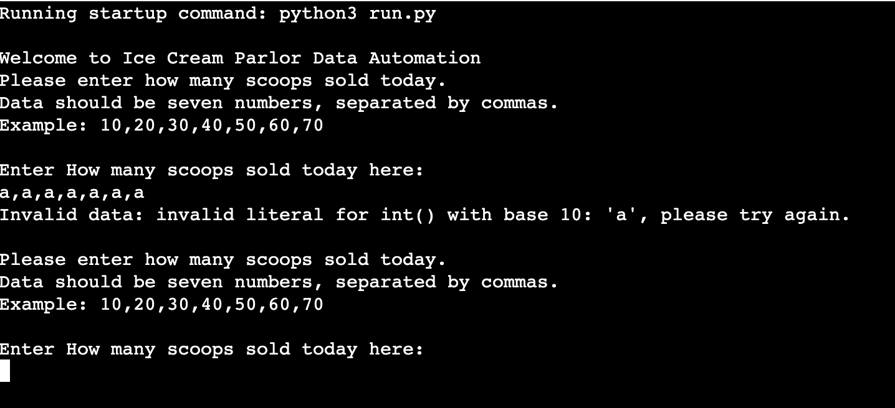
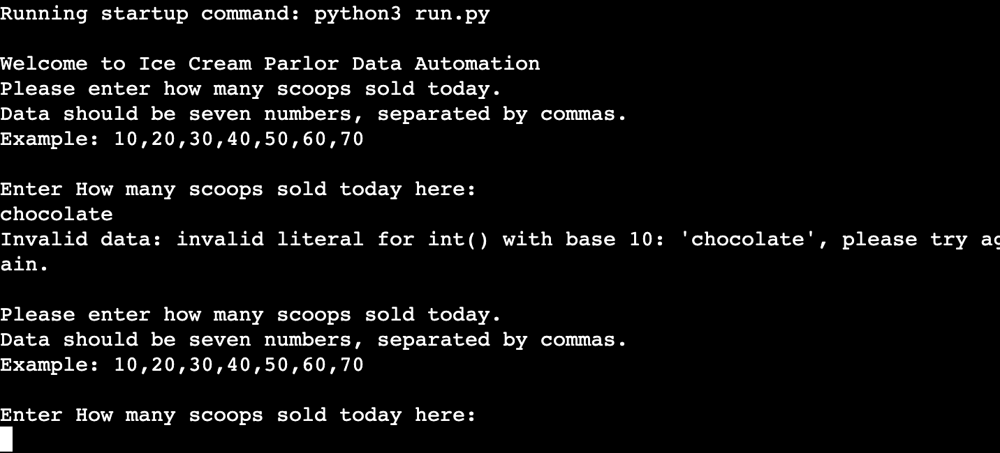
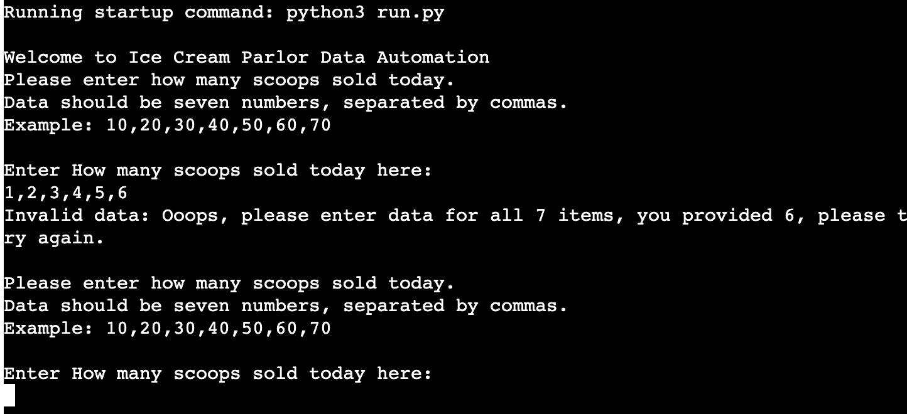

# ICE CREAM Parlor

The live link can be found here - https://ice-cream-parlour.herokuapp.com/

Welcome to the ice cream parlor data automation, this will allow the user to input sales numbers, and see how many scoops are remaining in each tub.

Each tub is 10 kg and each scoop is 55 grams meaning that you can get 181 scoops out of each tub of ice cream.

### How to use 

The user will enter how many scoops have been sold at the end of thew day and using Python calculations working with the spreadsheet it will calculate how many scoops are remaining in each tub.

If the user enters incorrect data they will see a error message, the user must enter the data as whole numbers followed by commas ans there are 7 flavors on sale they must enter how many scoops sold for each of thew 7 flavors.

### Features 

When you run the programme you are greeted by the following messages:

After you input the correct data you will see numerous messages confirming the following:

If you enter the data incorrectly for example not enough numbers you will see this message:

If you enter the data incorrectly for example: no numbers you will see this message:

### User Goals and objectives

The main goals and objectives of this programme are as follows

1. To give the user a easy way to input sales data
2. To provide the business owner with the sales data
3. To be simple to use with easy to follow instructions
4. The programme inputs the data into the spreadsheet, that is easily accesable to the manager/owner

### Deployment

To Deploy this project i used Heroku, the steps i used are as follows:

1.  Before deployment i installed the list of dependencies using the command pip3 freeze > requirements.txt
2. i then logged into my Heroku account and select new > create app 
3. then i name my app and select country/region
4. Settings > config vars, and in the "key" section i enter CREDS and in the "value" section i add the copy & pasted info from my CREDS.JSON file > add
5. Settings > build packs > add build pack > python > save changes > add build pack > nodes > save changes 
6. then ass the deployment feature was not working on Heroku i had to do it through my github terminal as follows:
7. To login enter: Heroku login -i, and enter your Heroku login details>
8. then enter: Heroku apps
9. then enter: Heroku git:remote -a 
10. and finally enter: git add., git commit -m ""Deploy to Heroku via CLI" & git push both git push: origin main & git push: Heroku main 

### Testing

i ran the code through the https://pep8online.com/

after reviewing the results i fixed all the errors with the results shown below

#### Manual Testing

i have enterered numbers, letters and words in the correct and wrong lengths into the deployed version on Heroku  to recieve the following results:

### Phase 2 

there are some additional features that could be added at a later stage to create a more detailed and complete picture for the user some of these are noted below

1. A weekly message that tells you your best selling flavour.
2. A weekly message that tells you your least popular flavour and suggests to create a promotion for this flavour.
3. A message that will remind you to restock a flavour when it is down to the last 10 - 15 scoops.
4. A random rotation of 10 feel good positive messages.

### Technologies Used 

https://pep8online.com/ - this was used to fix any errors found (mainly spacing issues)

https://heroku.com/ - this was used to deploy the programme.

https://docs.google.com/ - this was used for the spreadsheet data.

https://online-spellcheck.com/ this was used to check spelling and grammar of the readme file.

https://ami.com/ - this was used to create the screenshot image at the top of the readme file.

### Credits

code institutes love sandwiches walkthrough guide assisted me with writing the code

Marcel - My mentor Marcel was extreamly helpful as always helping me feel confident in what I have made.

