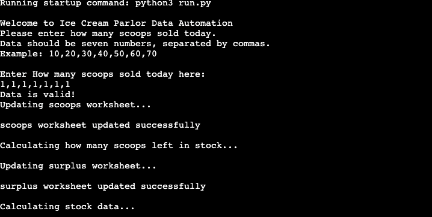
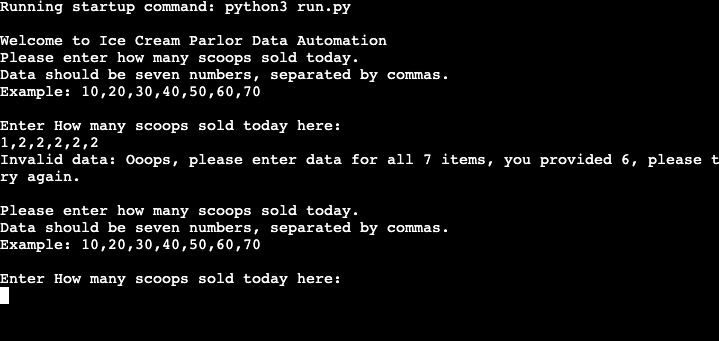
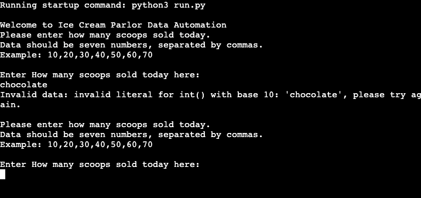
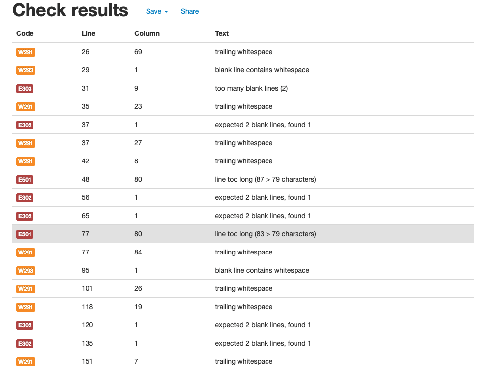
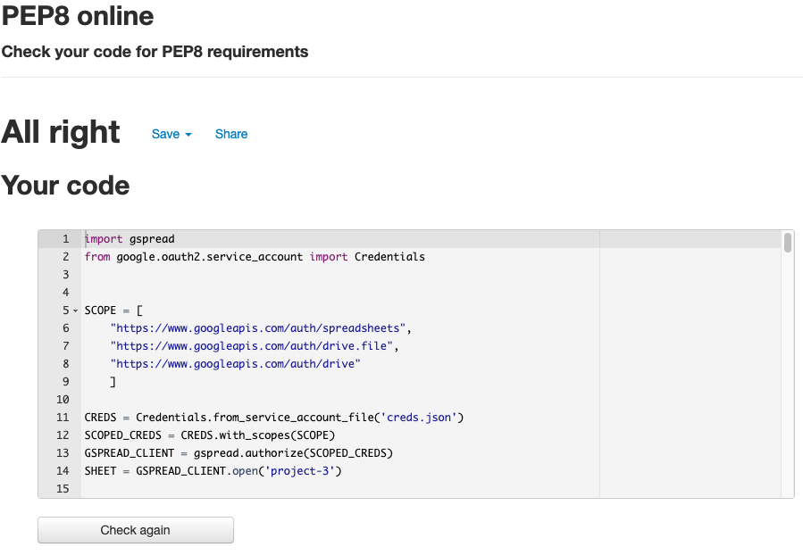

# ICE CREAM PARLOUR

The live link can be found here - https://ice-cream-parlour.herokuapp.com/

welcome to the ice cream parlour data automation, this will allow the user to input sales numbers, and see how many scoops are remaining in each tub.

Each tub is 10kg and each scoop is 55 grams meaning that you can get 181 scoops out of each tub of ice cream.

### How to use 

the user will enter how many scoops have been sold at the end of thew day and using pythonic calculations working with the spreadsheet it will calculate how many scoops are remaining in each tub.

if the user enters incorrect data they will see a error message, the user must enter the data as whole numbers followed by commas ans there are 7 flavours on sale they must enter how many scoops sold for each of thew 7 flavours.

### Features 

When you run the programme you are greeted by the following messages:

After you input the correct data you will see numerous messages confirming the following:

If you enter the data incorrectly for example not enough numbers you will see this message:

If you enter the data incorrectly for example: no numbers you will see this message:

### User Goals

### Deployment

To Deploy this project i used Heroku, the steps i used are as follows:

1.  Before deployment i installed the list of dependamcies using the command pip3 freeze > requirements.txt
2. i then logged into my heroku account and select new > create app 
3. then i name my app and select country/region
4. settings > config vars, and in the "key" section i enrter CREDS and in the "value" section i add the copy & pasted info from my CREDS.JSON file > add
5. settings > buildpacks > add buildpack > python > save changes > add buildpack > nodejs  > save changes 
6. then ass the deployment feature was not working on heroku i had to do it through my github terminal as follows:
7. To login enter:  heroku login -i, and enter your heroku login details>
8. then enter: heroku apps
9. then enter: heroku git:remote -a <app_name> 
10. and finally enter: git add ., git commit -m ""Deploy to Heroku via CLI" & git push both git push: origin main & git push: heroku main 

### Testing

i ran the code through the https://pep8online.com/

after reviewing the results i fixed all the errors with the results shown below

### Technologies Used 

https://pep8online.com/

### Credits

