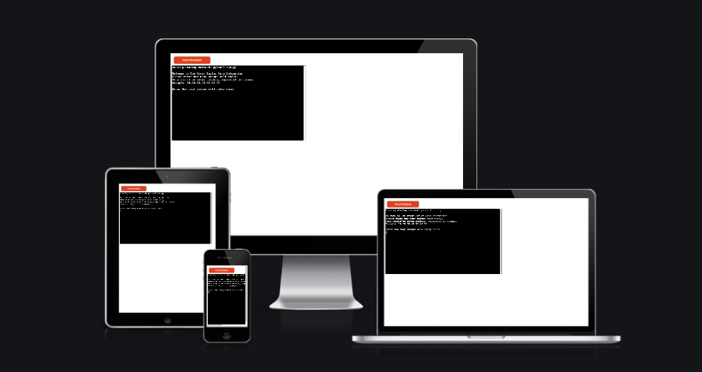

# ICE CREAM PARLOUR

welcome to the ice cream parlour data automation, this will allow the user to input sales numbers, and see how many scoops are remaining in each tub.

Each tub is 10kg and each scoop is 55 grams meaning that you can get 181 scoops out of each tub of ice cream.

### How to use 

the user will enter how many scoops have been sold at the end of thew day and using pythonic calculations working with the spreadsheet it will calculate how many scoops are remaining in each tub.

if the user enters incorrect data they will see a error message, the user must enter the data as whole numbers followed by commas ans there are 7 flavours on sale they must enter how many scoops sold for each of thew 7 flavours.

### Features 

### Deployment

To Deploy this project i used Heroku, the steps i used are as follows:

1.  Before deployment i installed the list of dependamcies using the command pip3 freeze > requirements.txt
2. i then logged into my heroku account and select new > create app 
3. then i name my app and select country/region
4. settings > config vars, and in the "key" section i enrter CREDS and in the "value" section i add the copy & pasted info from my CREDS.JSON file > add
5. settings > buildpacks > add buildpack > python > save changes > add buildpack > nodejs  > save changes 
6. then ass the deployment feature was not working on heroku i had to do it through my github terminal as follows:
7. To login enter:  heroku login -i, and enter your heroku login details>
8. then enter: heroku apps
9. then enter: heroku git:remote -a <app_name> 
10. and finally enter: git add ., git commit -m ""Deploy to Heroku via CLI" & git push both git push: origin main & git push: heroku main 

### Credits

Welcome MrFogg866,

This is the Code Institute student template for deploying your third portfolio project, the Python command-line project. The last update to this file was: **August 17, 2021**

## Reminders

* Your code must be placed in the `run.py` file
* Your dependencies must be placed in the `requirements.txt` file
* Do not edit any of the other files or your code may not deploy properly

## Creating the Heroku app

When you create the app, you will need to add two buildpacks from the _Settings_ tab. The ordering is as follows:

1. `heroku/python`
2. `heroku/nodejs`

You must then create a _Config Var_ called `PORT`. Set this to `8000`

If you have credentials, such as in the Love Sandwiches project, you must create another _Config Var_ called `CREDS` and paste the JSON into the value field.

Connect your GitHub repository and deploy as normal.

## Constraints

The deployment terminal is set to 80 columns by 24 rows. That means that each line of text needs to be 80 characters or less otherwise it will be wrapped onto a second line.

-----
Happy coding!